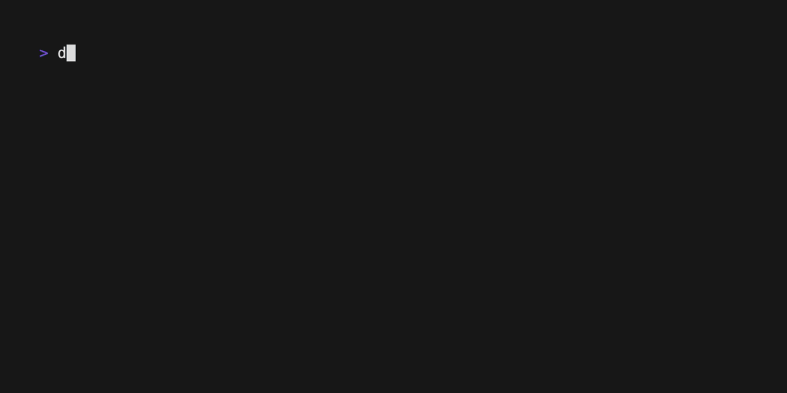

<p align="center">
  <a href="https://github.com/blacktop/TEMPLATE"></a>
  <h1 align="center">go-template</h1>
  <h4><p align="center">Go Project Template</p></h4>
  <p align="center">
    <a href="https://github.com/blacktop/TEMPLATE/actions" alt="Actions">
          </a>
    <a href="https://github.com/blacktop/TEMPLATE/releases/latest" alt="Downloads">
          </a>
    <a href="https://github.com/blacktop/TEMPLATE/releases" alt="GitHub Release">
          </a>
    <a href="http://doge.mit-license.org" alt="LICENSE">
          </a>
</p>
<br>

## Why? 🤔

<!-- Fill this out -->

## Getting Started

### Install

```bash
go install github.com/blacktop/go-template@latest
```

<!-- Fill this out -->



## License

MIT Copyright (c) <YEAR> **blacktop**